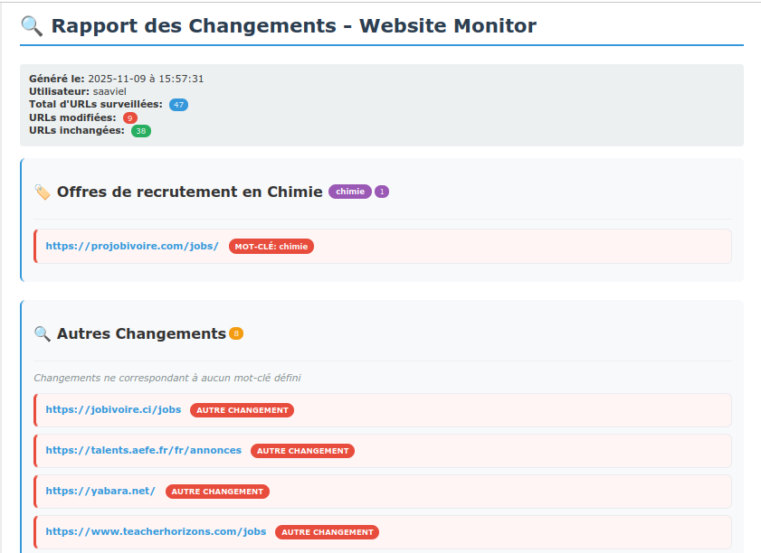

# 🌐 Advanced Website Monitor

[](https://www.gnu.org/software/bash/)


A powerful and flexible Bash script to monitor specific websites for changes. It uses a hybrid fetching mechanism (cURL + Puppeteer) to handle both static and dynamic JavaScript-heavy websites, identifies changes based on keywords, and provides rich notifications.

This tool is designed to run automatically as a `systemd` service or `cron` job, providing desktop (`zenity`) and remote (`Telegram`) alerts when specific content is detected.

## Key Features

* **Hybrid Fetching:** Uses `curl` for fast, simple sites and automatically switches to **Puppeteer with Stealth Plugin** for complex, JavaScript-rendered sites (like React, Angular, Vue) to avoid bot detection.
* **Targeted Zone Monitoring:** Monitor the *entire* page or specify precise content zones (`between`, `before`, `after` specific HTML/text markers) for each URL.
* **Keyword-Based Change Detection:** Instead of just alerting on *any* change (like a timestamp), it scans the actual `diff` for keywords you define (e.g., "recruitment", "sold out", "new offer").
* **Categorized HTML Reports:** Generates a clean HTML report (`changes_report.html`) that categorizes all detected changes by the keywords they matched.
* **Multi-Channel Alerts:**
    * **Desktop:** Native notifications using `zenity`, `kdialog`, or `notify-send`.
    * **Remote:** Instant alerts via **Telegram**.
* **Built-in Utilities:**
    * `--diagnose`: Tests a URL with both `curl` and `Puppeteer` to help you decide the best fetching strategy.
    * `--keywords`: An interactive menu to easily add, remove, or test keywords.
    * `--install-deps`: Automatically installs system dependencies required for the script.

## File Structure

The script is designed to run from a base directory (e.g., `$HOME/website_monitor`), which it will populate with the following structure:

```
/website_monitor/
├── website-monitor.sh    # The main executable script
├── url_list.txt          # [USER] Your list of URLs to monitor
├── keywords.txt          # [USER] Your list of keywords to find
├── changes_report.html   # [GENERATED] The HTML report
├── global_change.log     # [GENERATED] Main log file
├── puppeteer_fetch.js    # [GENERATED] The Puppeteer script
├── puppeteer_module/     # [GENERATED] Local Node.js environment
│   ├── node_modules/
│   └── package.json
└── snapshots/            # [GENERATED] Database of snapshots
    ├── <url_hash_1>/
    │   ├── current_raw.html
    │   ├── current_text.txt
    │   ├── previous_text.txt
    │   ├── zone_config.conf  # <-- Per-URL advanced configuration
    │   └── change.log
    └── <url_hash_2>/
        ...
```

## 1. Installation

1.  **Clone the repository:**
    ```bash
    git clone https://github.com/saavielconstant/website-monitor.git
    cd website-monitor
    ```

2.  **Make the script executable:**
    ```bash
    chmod +x website-monitor.sh
    ```

3.  **Install Dependencies:**
    The script requires `curl`, `html2text`, and `nodejs`/`npm` (for Puppeteer).
    You can use the built-in installer:
    ```bash
    ./website-monitor.sh --install-deps
    ```
    This will install `html2text`, `nodejs`, `npm`, and all necessary dependencies for Puppeteer, and then run `npm install` for `puppeteer-extra` and the `stealth-plugin`.

## 2. Configuration

On the first run, the script will create `url_list.txt` and `keywords.txt` for you.

1.  **Edit `url_list.txt`:**
    Add the websites you want to monitor, one URL per line.
    ```
    # This is a comment
    [https://www.example.com](https://www.example.com)
    [https://github.com/trending](https://github.com/trending)
    ```

2.  **Edit `keywords.txt`:**
    Add the keywords you want to search for in the format `keyword|description`.
    ```
    # Format: keyword|description
    recrutement|Job Offers, Recruitment
    offre d emploi|Job Announcements
    promotion|Sales and Promotions
    ```

3.  **(Optional) Enable Telegram Alerts:**
    Edit the `website-monitor.sh` script and set the following variables:
    ```bash
    # Configuration des alertes Telegram
    TELEGRAM_BOT_TOKEN="your_bot_token_here"
    TELEGRAM_CHAT_ID="your_chat_id_here"
    ENABLE_TELEGRAM_ALERTS=true
    ```

4.  **(Optional) Enable Puppeteer Globally:**
    By default, Puppeteer is disabled. You can enable it globally if you primarily monitor dynamic sites.
    ```bash
    # Configuration Puppeteer
    ENABLE_PUPPETEER=true
    ```
    **Note:** The recommended way is to enable Puppeteer on a *per-site* basis using the `zone_config.conf` (see Advanced Usage).

## 3. Usage

Simply run the script:

```bash
./website-monitor.sh
```

The script will:
1.  Loop through `url_list.txt`.
2.  Fetch each page (using cURL or Puppeteer).
3.  Clean and convert it to text.
4.  Compare it to the previous snapshot.
5.  If changes are found, scan the `diff` for keywords.
6.  Generate the HTML report and send alerts.
7.  Open the final report (`changes_report.html`) automatically.

### Command-line Utilities

* **Diagnose a URL:**
    ```bash
    ./website-monitor.sh --diagnose [https://www.example.com](https://www.example.com)
    ```
* **List all monitored URLs:**
    ```bash
    ./website-monitor.sh --list-urls
    ```
* **Manage keywords interactively:**
    ```bash
    ./website-monitor.sh --keywords
    ```

## 4. Advanced: Zone Monitoring & Forcing Puppeteer

This is the most powerful feature of the script. For each URL, the script creates a `zone_config.conf` file in its snapshot directory (e.g., `snapshots/<hash>/zone_config.conf`).

You can edit this file to change the monitoring behavior for *that specific URL*.

**Example:**
You want to monitor a job board, but *only* the main job list, and you want to ignore the "featured jobs" sidebar and the footer. You also know this site requires JavaScript.

1.  Run `./website-monitor.sh --list-urls` to find the snapshot directory for your URL.
2.  Edit its `zone_config.conf` file:

    ```bash
    # /website_monitor/snapshots/a1b2c3d4e5/zone_config.conf

    # Mode: full, between, before, after
    ZONE_MODE="between"

    # Force Puppeteer for this JS-heavy site
    FORCE_PUPPETEER="true"
    
    # Start monitoring AFTER this text/HTML
    ZONE_START="<div id=\"job-listing-container\">"
    
    # Stop monitoring BEFORE this text/HTML
    ZONE_END="<div id=\"sidebar\">"
    ```

Now, the script will *only* look for changes to keywords within that specific `<div>`.

## 5. Automation (Systemd & Cron)

To be effective, this script should run on a schedule. Here are two methods.

### Method 1: Systemd (Recommended)

This method is robust and automatically handles logging. We will create a **user service** so it can easily access your desktop for `zenity` notifications.

1.  **Create the service files directory:**
    ```bash
    mkdir -p ~/.config/systemd/user/
    ```

2.  **Create the `.service` file:**
    Create `~/.config/systemd/user/website-monitor.service`

    ```ini
    [Unit]
    Description=Website Change Monitor
    
    [Service]
    Type=oneshot
    # IMPORTANT: Update this path to your script's location
    ExecStart=/home/YOUR_USER/website-monitor/website-monitor.sh
    
    # This is necessary for Zenity/KDialog GUI notifications
    Environment=DISPLAY=:0
    Environment=DBUS_SESSION_BUS_ADDRESS=unix:path=/run/user/%U/bus
    
    [Install]
    WantedBy=default.target
    ```
    *Replace `YOUR_USER` with your username.*

3.  **Create the `.timer` file:**
    This will run the service every 30 minutes. Create `~/.config/systemd/user/website-monitor.timer`

    ```ini
    [Unit]
    Description=Run Website Monitor every 30 minutes
    
    [Timer]
    # Run 5 minutes after boot, and then every 30 minutes
    OnBootSec=5min
    OnUnitActiveSec=30min
    
    [Install]
    WantedBy=timers.target
    ```

4.  **Enable and Start the Timer:**
    ```bash
    # Reload systemd to read the new files
    systemctl --user daemon-reload
    
    # Enable the timer to start on boot
    systemctl --user enable website-monitor.timer
    
    # Start the timer now
    systemctl --user start website-monitor.timer
    ```

5.  **Check the status:**
    ```bash
    systemctl --user list-timers
    journalctl --user -u website-monitor.service -f
    ```

### Method 2: Cron (Classic)

1.  Open your crontab:
    ```bash
    crontab -e
    ```

2.  Add the following line to run the script every 30 minutes:

    ```crontab
    # Run website-monitor every 30 minutes
    # We must export DISPLAY=:0 for Zenity GUI notifications to work
    */30 * * * * export DISPLAY=:0 && /home/YOUR_USER/website-monitor/website-monitor.sh
    ```
    *Replace `YOUR_USER` with your username and update the path to your script.*

## License

This project is licensed under the MIT License.
